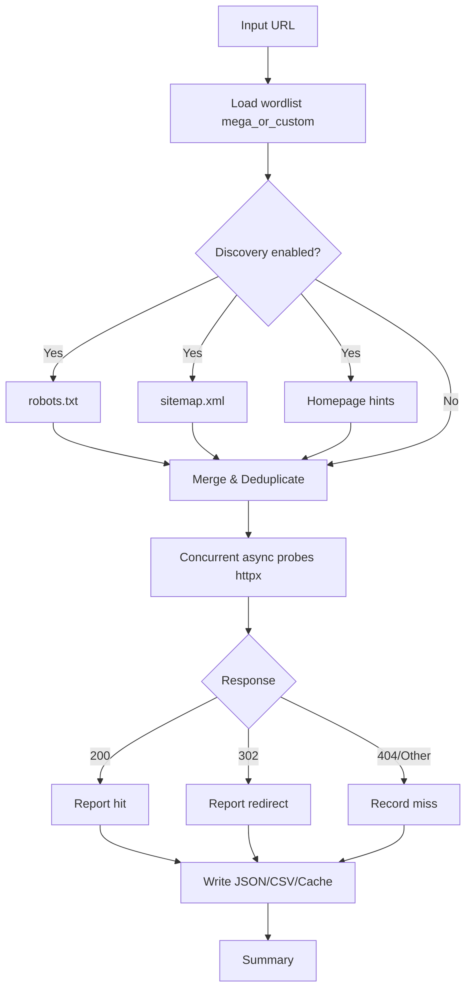

# Admin Page Finder

[](https://github.com/GeekLord/Admin-Page-Finder/actions/workflows/ci.yml)


Fast async admin page finder with modern HTTP, discovery helpers, and curated wordlists.

Repository: `https://github.com/GeekLord/Admin-Page-Finder`

---

## Features
- High-performance async scanner powered by `httpx` (HTTP/1.1 + HTTP/2), `asyncio`
- Massive built-in mega wordlist plus stack-specific lists
- Discovery helpers: robots.txt, sitemap.xml, homepage link hints
- Robust networking controls: timeouts, follow-redirects toggle, TLS verify toggle
- Rate limiting (global token bucket) and per-host concurrency caps
- Proxy support, custom headers/cookies, optional User-Agent rotation
- Structured logging (plain or JSON), progress bars, quiet/verbose
- Outputs: human-readable, JSON, CSV; cache/resume via JSONL
- Clean code with type hints, `ruff` and `black`; unit + integration tests; CI

## Technology
- Core: Python 3.9+, `asyncio`, `anyio`
- HTTP: `httpx`
- CLI: `Typer` + `Rich`
- Reliability: `tenacity` (retries with jitter)
- Lint/Format: `ruff`, `black`
- Tests: `pytest`, `pytest-asyncio`, `respx`

---

## Install

```bash
pip install -e .[dev]
```

This creates a console script named `apf`.

---

## Quick Start

Scan a target with the built-in mega wordlist and discovery enabled by default:

```bash
apf scan https://example.com
```

Common options:

```bash
apf scan https://example.com \
  -c 100 --per-host 10 --rate 50 --timeout 10 \
  --json results.json --csv results.csv \
  --discover --cache .apf-cache.jsonl \
  --proxy http://127.0.0.1:8080 --rotate-ua \
  --header "X-My-Header: value" --cookie "session=abc"
```

- `--discover/--no-discover`: include robots.txt, sitemap.xml, homepage hints
- `--rate/--burst`: global rate limiting
- `--no-verify`, `--no-redirects`, `--proxy`, `--rotate-ua`, `--header`, `--cookie`
- Output: `--json` and/or `--csv`

If your shell resolves an old entry point, call the module directly:

```bash
python -m admin_page_finder.cli scan https://example.com
```

---

## CLI Help

```bash
apf --help
apf scan --help
```

---

## Wordlists
- Default: `src/admin_page_finder/wordlists/mega.txt` (combined + deduped)
- Additional: `core.txt`, `php.txt`, `python.txt`, `node.txt`, `java.txt`
- Provide a custom list via `-w your_list.txt` if desired

Paths from discovery (robots/sitemap/homepage) are merged and de-duplicated automatically.

---

## How It Works



---

## Output Examples

- Console (hits only shown in green):

```text
[200] https://example.com/admin/ (85 ms, 4312 bytes)
[302] https://example.com/login (120 ms, 0 bytes) [redirect]
```

- JSON file:

```json
[
  {
    "path": "/admin/",
    "url": "https://example.com/admin/",
    "status": 200,
    "ok": true,
    "redirected": false,
    "final_url": "https://example.com/admin/",
    "elapsed_ms": 85,
    "content_length": 4312
  }
]
```

- CSV file has columns: `path,url,status,ok,redirected,final_url,elapsed_ms,content_length`

---

## Performance Tips
- Increase `--concurrency` and `--per-host` cautiously to reduce scan time
- Use `--rate` to throttle globally when scanning big lists
- Disable `--discover` if you want strict wordlist-only scanning

---

## Development

```bash
# Lint & format
ruff check . && ruff format --check .

# Tests
pytest -q

# Pre-commit hooks
pre-commit install
```

Project layout:
- `src/admin_page_finder/` – library & CLI
- `src/admin_page_finder/wordlists/` – built-in lists
- `tests/` – unit & integration tests
- `.github/workflows/ci.yml` – CI pipeline

---

## Troubleshooting
- Entry-point confusion: reinstall editable and verify PATH
  - `pip uninstall -y admin-page-finder && pip install -e .`
  - `apf --help` (should show the `scan` subcommand)
  - Or run: `python -m admin_page_finder.cli scan https://example.com`
- Proxy option uses httpx ≥ 0.28 style: `--proxy http://host:port`

---

## Author
- **Shobhit Kumar Prabhakar**
- GitHub: `https://github.com/GeekLord/Admin-Page-Finder`

---

## License
MIT

---

## References
- Project repository and usage examples: [GitHub – GeekLord/Admin-Page-Finder](https://github.com/GeekLord/Admin-Page-Finder)
